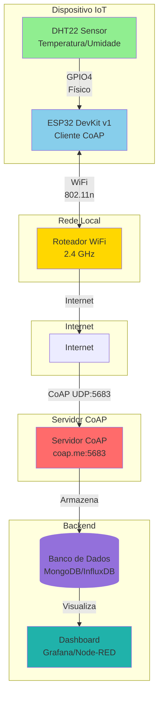

# React + Vite

This template provides a minimal setup to get React working in Vite with HMR and some ESLint rules.

Currently, two official plugins are available:

- [@vitejs/plugin-react](https://github.com/vitejs/vite-plugin-react/blob/main/packages/plugin-react) uses [Babel](https://babeljs.io/) for Fast Refresh
- [@vitejs/plugin-react-swc](https://github.com/vitejs/vite-plugin-react/blob/main/packages/plugin-react-swc) uses [SWC](https://swc.rs/) for Fast Refresh

## Expanding the ESLint configuration

If you are developing a production application, we recommend using TypeScript with type-aware lint rules enabled. Check out the [TS template](https://github.com/vitejs/vite/tree/main/packages/create-vite/template-react-ts) for information on how to integrate TypeScript and [`typescript-eslint`](https://typescript-eslint.io) in your project.


# 📐 Diagrama da Arquitetura de Rede

## Diagrama Visual (Mermaid)



## Fluxo de Dados

```
┌─────────────┐
│   DHT22     │  Lê temperatura e umidade
│   Sensor    │
└──────┬──────┘
       │ GPIO4 (dados)
       ▼
┌─────────────────┐
│                 │  Formata em JSON
│     ESP32       │  {"temp": 25.5, "hum": 60.2, ...}
│   DevKit v1     │
│                 │
│  Cliente CoAP   │
└────────┬────────┘
         │ WiFi (2.4 GHz)
         ▼
┌─────────────────┐
│  Roteador WiFi  │  Roteamento IP
└────────┬────────┘
         │ Internet (TCP/IP)
         ▼
┌─────────────────┐
│  Servidor CoAP  │  Recebe POST
│   coap.me:5683  │  Retorna 2.01 Created
└────────┬────────┘
         │ Processa dados
         ▼
┌─────────────────┐
│ Banco de Dados  │  Armazena histórico
│  MongoDB/Influx │
└─────────────────┘
```

## Protocolos Utilizados

| Camada         | Protocolo    | Porta | Descrição                        |
| -------------- | ------------ | ----- | -------------------------------- |
| **Física**     | GPIO         | -     | Comunicação direta ESP32 ↔ DHT22 |
| **Rede**       | WiFi 802.11n | -     | Comunicação sem fio local        |
| **Transporte** | UDP          | 5683  | Protocolo de transporte CoAP     |
| **Aplicação**  | CoAP         | 5683  | Protocolo REST para IoT          |
| **Formato**    | JSON         | -     | Estrutura dos dados enviados     |

## Componentes da Arquitetura

### 1. Camada de Sensores

- **DHT22**: Sensor digital de temperatura e umidade
- **Interface**: GPIO4 do ESP32
- **Taxa de atualização**: A cada 5 segundos

### 2. Camada de Processamento

- **ESP32**: Microcontrolador com WiFi integrado
- **Função**:
  - Ler dados do sensor
  - Formatar em JSON
  - Enviar via CoAP

### 3. Camada de Rede

- **WiFi**: Conexão local sem fio
- **Internet**: Roteamento IP para servidor remoto

### 4. Camada de Servidor

- **Servidor CoAP**: Recebe e processa requisições
- **Endpoint**: `/sink` (aceita qualquer POST)
- **Resposta**: Código 2.01 Created

### 5. Camada de Armazenamento

- **Banco de dados**: Persistência dos dados
- **Dashboard**: Visualização em tempo real

---

_Diagrama criado para o projeto ESP32 + CoAP + DHT22_
