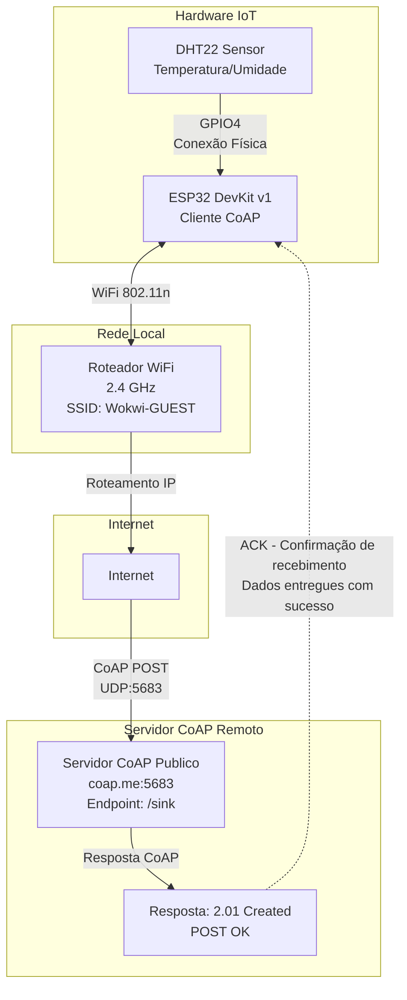

# 📐 Diagrama da Arquitetura de Rede

## Arquitetura Implementada (Atual)

Este diagrama representa a arquitetura REAL do projeto implementado:



## Fluxo de Dados (Implementado)

```
┌─────────────┐
│   DHT22     │  Lê temperatura e umidade a cada 5 segundos
│   Sensor    │  Exemplo: Temp: 24.0°C, Umidade: 40.0%
└──────┬──────┘
       │ GPIO4 (comunicação digital)
       ▼
┌─────────────────┐
│                 │  1. Lê valores do sensor
│     ESP32       │  2. Formata em JSON:
│   DevKit v1     │     {"temp":24.0,"hum":40.0,"device":"ESP32-DHT22","id":1}
│                 │  3. Envia via CoAP POST
│  Cliente CoAP   │
└────────┬────────┘
         │ WiFi (2.4 GHz)
         │ SSID: Wokwi-GUEST
         ▼
┌─────────────────┐
│  Roteador WiFi  │  Roteamento IP
│   (Simulado)    │
└────────┬────────┘
         │ Internet
         │ Protocolo: UDP na porta 5683
         ▼
┌─────────────────┐
│  Servidor CoAP  │  Recebe requisição POST
│   coap.me:5683  │  Endpoint: /sink
│   (Publico)     │
└────────┬────────┘
         │
         ▼
┌─────────────────┐
│  Resposta CoAP  │  Código: 65 (2.01 Created)
│   "POST OK"     │  Confirmação de recebimento
└─────────────────┘

NOTA: O servidor coap.me/sink é um servidor público de testes que apenas
      recebe e confirma os dados. Não há armazenamento permanente.
```

## O que é ACK?

**ACK** (Acknowledgment = Reconhecimento) é uma mensagem de confirmação enviada pelo servidor para informar ao cliente que:

- ✅ A mensagem foi **recebida com sucesso**
- ✅ O servidor **processou** a requisição
- ✅ A operação foi **bem-sucedida**

### No protocolo CoAP:

1. **Cliente (ESP32)** envia uma requisição **CON** (Confirmable) via POST
2. **Servidor (coap.me)** processa e responde com:
   - **Código de resposta**: 2.01 Created (sucesso)
   - **ACK implícito**: A resposta em si é o reconhecimento
3. **Cliente** recebe a confirmação e sabe que os dados foram entregues

### Tipos de mensagens CoAP:

- **CON (Confirmable)**: Requer confirmação (ACK)
- **NON (Non-confirmable)**: Não requer confirmação
- **ACK (Acknowledgment)**: Resposta confirmando recebimento
- **RST (Reset)**: Indica erro ou recusa

No projeto, o ESP32 envia mensagens CON e recebe ACK do servidor com código 2.01 Created.

## Protocolos Utilizados

| Camada         | Protocolo    | Porta | Descrição                        |
| -------------- | ------------ | ----- | -------------------------------- |
| **Física**     | GPIO         | -     | Comunicação direta ESP32 ↔ DHT22 |
| **Rede**       | WiFi 802.11n | -     | Comunicação sem fio local        |
| **Transporte** | UDP          | 5683  | Protocolo de transporte CoAP     |
| **Aplicação**  | CoAP         | 5683  | Protocolo REST para IoT          |
| **Formato**    | JSON         | -     | Estrutura dos dados enviados     |

## Componentes da Arquitetura

### 1. Camada de Sensores

- **DHT22**: Sensor digital de temperatura e umidade
- **Interface**: GPIO4 do ESP32
- **Taxa de atualização**: A cada 5 segundos

### 2. Camada de Processamento

- **ESP32**: Microcontrolador com WiFi integrado
- **Função**:
  - Ler dados do sensor
  - Formatar em JSON
  - Enviar via CoAP

### 3. Camada de Rede

- **WiFi**: Conexão local sem fio
- **Internet**: Roteamento IP para servidor remoto

### 4. Camada de Servidor

- **Servidor CoAP**: `coap.me` - servidor público de testes
- **Endpoint**: `/sink` (aceita qualquer POST e retorna confirmação)
- **Resposta**: Código 65 (2.01 Created) com payload "POST OK"
- **Função**: Valida a comunicação CoAP (não armazena dados permanentemente)

**Nota**: Este é um servidor de demonstração. Para produção, seria necessário:

- Servidor CoAP próprio (Eclipse Californium, Aiocoap, etc.)
- Banco de dados para persistência
- Dashboard para visualização

---

_Diagrama criado para o projeto ESP32 + CoAP + DHT22_
